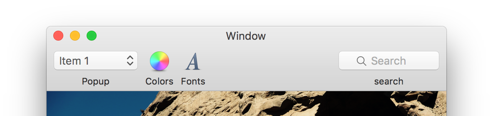
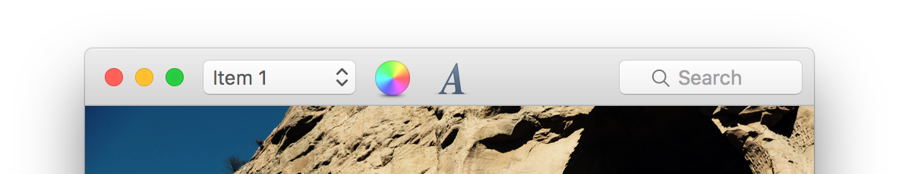
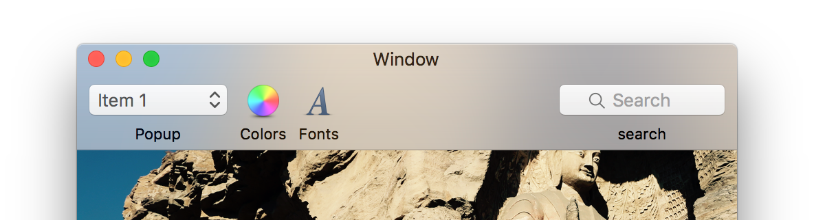
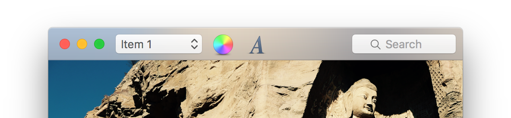
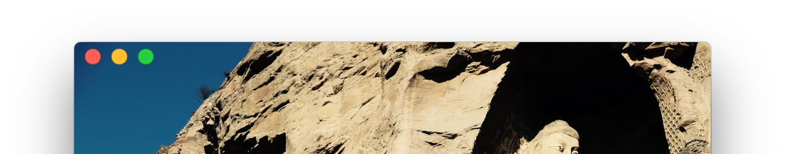
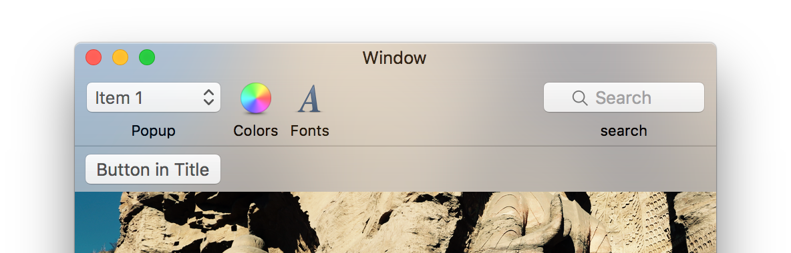
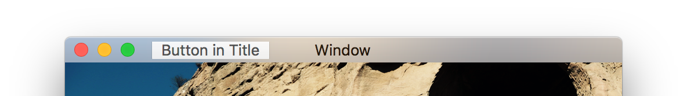
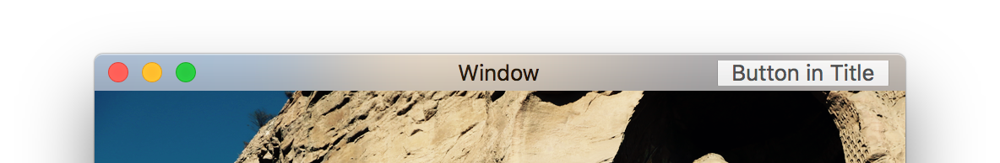

# Title bar and Toolbar of NSWindow examples

[](https://developer.apple.com/macos/)
[](https://developer.apple.com/swift/)
[](http://mit-license.org)
[](http://twitter.com/robinlu)

This is a showcase for several combinations of styles of title bar and toolbar of NSWindow.


## Title visibility
By default, the title of window is visible.


```swift
window.titleVisibility = .visible
```


This is a window with a toolbar while the title set to invisible:

```swift
window.titleVisibility = .hidden
```
Example applications: Calendar, Notes, Xcode

## Full size content view
When setting the NSWindowStyleMask.fullSizeContentView, the content view extends to the whole window. The title bar and toolbar use a blur effect if visible.
```swift
window.styleMask.insert(NSWindowStyleMask.fullSizeContentView)
```

When both title and toolbar are visible:


When title is invisible:

Example applications: Safari, Photos, Wunderlist

## Transparent title bar
If you want to hide the title bar but still need the window buttons (such as close button, minimize button and screen button), you can set the titlebar to transparent:
```swift
window.titlebarAppearsTransparent = true
```

You may want to hide the title and use full size content view to get the following style.
```swift
window.titlebarAppearsTransparent = true
window.titleVisibility = .hidden
window.styleMask.insert(NSWindowStyleMask.fullSizeContentView)
```

Example application: Reeder, 

## Title accessory view
According to the documentation, title accessory view is a custom view you can put along with the title bar.

There are three layout choices.

At the bottom of title bar:

It’s at the bottom of title bar or toolbar. You can set the height of the view.

On the left of the title bar:

You can set the width of the view. The height of the title bar is fixed. If you set the height of the title accessory view, it doesn’t affect the height of the title and is clipped by the title bar. If the toolbar exist, it overlaps with the toolbar.

On the right of the title bar:

You can set the width of the view. The height of the title bar is fixed. If you set the height of the title accessory view, it doesn’t affect the height of the title and is clipped by the title bar. If the toolbar exist, it overlaps with the toolbar.

Example application: IA Writer

One thing to remember. **You have to set the layout attribute before add the accessory view to the title**.

## Unified title and toolbar
Looks like this has been deprecated. No matter what you set, the title bar and toolbar are unified since Yosemite.

## Author
[Lu Yibin](http://robin.github.io)
